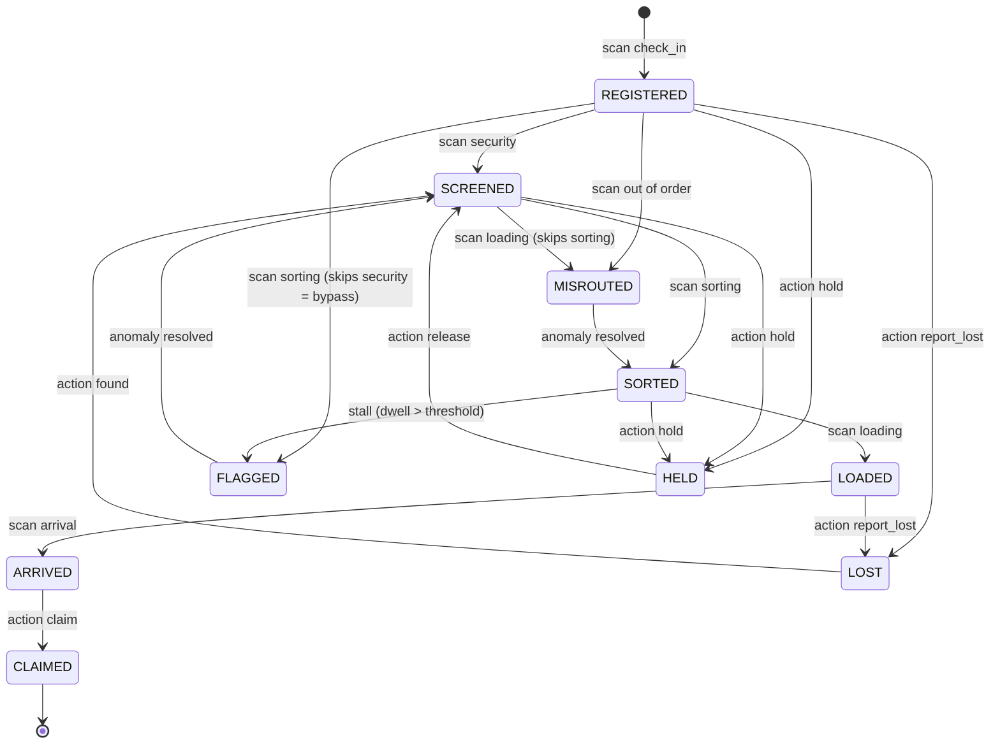

––# SkyWatcher — Event-Driven Bag Tracking Upgrade (Design Plan)

**Status:** Proposed — for review with supervisor before implementation
**Author:** B032310853 · PSM 2025/2026 · UTeM FTMK
**Date:** 2026-06-19

---

## 1. The problem (supervisor's feedback)

> "The bag tracking just uses a timer. It shows the system's inability to **receive input**, to **process** it, and to **change** the tracking status."

This is a valid critique of how the system currently *presents*. The bag journey is produced by `simulator/rfid_sim.py`, which emits checkpoint events on a timer and publishes them to MQTT. The backend records them. To an examiner this looks like **scripted playback**, not a reactive system.

### What actually exists today

| Capability | Current state | Limitation |
|---|---|---|
| Receive input | `POST /api/events` and MQTT ingestion exist (`backend/mqtt_client.py`) | The only *visible* input is the auto-timer simulator — nothing unscripted / human-driven |
| Process | `detect_anomaly()` runs Isolation Forest + rules on every event (`backend/models/anomaly.py`) | Real, but invisible in the demo, and its result never affects the bag's status |
| Change status | `status = 'arrived' if checkpoint=='arrival' else 'in_transit'` (`backend/models/database.py: insert_event`) | Trivial: 2 values, no state machine, no validation, no exception handling |

**Conclusion:** the ingestion + ML bones are present. What's missing is a *visible, validated, stateful* loop driven by *real inputs*. This plan adds exactly that.

---

## 2. Goal

Turn SkyWatcher from "timed playback" into a **reactive event-driven system** that demonstrably:

1. **Receives input** from real, unscripted sources (operator scans via mobile QR + dashboard; device feed).
2. **Processes** each input against business rules (a validated state machine + anomaly detection).
3. **Changes tracking status** as a decided outcome — including exception states — visible live.

**Reframing for the panel:** the simulator is kept, but recast as *one* event producer (automated RFID gates). Operators with the mobile app / dashboard are *another* producer (handheld scanners). Both feed the **same ingestion → processing → state engine**. The timer becomes a load generator, not the whole system.

---

## 3. Core design — the Bag State Machine

A bag's tracking status becomes a **finite state machine (FSM)**. Every transition is triggered by an *input* (a checkpoint scan or an operator action) and gated by a *guard* (validation rule). Illegal inputs are rejected or routed to an exception state — this *is* the "processing" the supervisor wants.

### 3.1 States

**Happy-path lifecycle**

| Status | Meaning | Entered by |
|---|---|---|
| `REGISTERED` | Checked in | scan `check_in` |
| `SCREENED` | Passed security | scan `security` |
| `SORTED` | Passed sorting | scan `sorting` |
| `LOADED` | Loaded for flight | scan `loading` |
| `ARRIVED` | Reached destination | scan `arrival` |
| `CLAIMED` | Collected by passenger (terminal) | operator action `claim` |

**Exception / operational states**

| Status | Meaning | Entered by |
|---|---|---|
| `FLAGGED` | Anomaly detected (stall / bypass) — needs review | processing result |
| `MISROUTED` | Checkpoint out of sequence (wrong route) | processing result |
| `HELD` | Security hold placed | operator action `hold` |
| `LOST` | Reported missing — search initiated | operator action `report_lost` |

### 3.2 Transition diagram

### 3.3 Processing rules (the "decide" step)

When a scan input arrives for a bag:

1. Look up the bag's **current status**.
2. Compute the **expected next checkpoint** from the FSM.
3. **Decide:**
   - Input matches expected → **advance** to the next happy-path state.
   - Input skips `security` → **SECURITY_BYPASS** anomaly → status `FLAGGED`.
   - Input out of sequence → **WRONG_ROUTE** anomaly → status `MISROUTED`.
   - Dwell time exceeds threshold → **STALL** anomaly → status `FLAGGED`.
4. **Persist** the new status, append to the status-history log, fire anomaly + email if any.

This wraps the existing `detect_anomaly()` so the ML/rule output now **changes state** instead of only logging.

---

## 4. Inputs (the "receive" step)

| Input source | Mechanism | Who |
|---|---|---|
| **Mobile QR scan** (flagship) | Scan the printed QR bag tag → pick checkpoint → `POST /api/bags/:tag/scan` | Ground staff |
| **Dashboard manual scan** | "Register scan" control in the bag modal | Staff / admin |
| **Operator actions** | Hold / Release / Reroute / Claim / Report lost / Found | Staff / admin |
| **Device feed** | Existing `POST /api/events` + MQTT (simulator) | Automated |

All four flow through the **same** state machine, proving the system is input-agnostic and reactive — not timer-bound.

---

## 5. Implementation breakdown

### 5.1 Backend
- **New** `backend/models/state_machine.py` — `STATES`, `TRANSITIONS`, and `decide(current_status, trigger, context) -> (new_status, anomaly|None)`. Pure, unit-testable "brain."
- `backend/models/database.py` — route `insert_event` through `state_machine.decide()`; add `bag_status_history` writes; add `apply_operator_action()`.
- **New** endpoints in `backend/routes/baggage.py`:
  - `POST /api/bags/<tag>/scan` → register a checkpoint scan (auth: staff/admin).
  - `POST /api/bags/<tag>/action` → operator action (hold/release/reroute/claim/report_lost/found).
  - `GET  /api/bags/<tag>/status-history` → the transition audit trail.
- `backend/mqtt_client.py` — unchanged entry point; benefits automatically via `insert_event`.
- Resolving an anomaly (`resolve_alert`) also transitions the bag back (`FLAGGED→SCREENED`, `MISROUTED→SORTED`).

### 5.2 Database (Supabase SQL — `backend/sql/state_machine.sql`)
- `bags.status` now stores FSM states (string). Add `bags.status_updated_at timestamptz`.
- **New table** `bag_status_history` — `id, tag_id, from_status, to_status, trigger, actor, checkpoint, created_at`. An auditable state-change trail (great for the report and the demo).
- Backward-compat: map legacy `in_transit`/`arrived` into the new states on first touch.

### 5.3 Dashboard (`skywatcher-dashboard`)
- Bag detail modal: current-status badge (color-coded by state), **status-history timeline**, operator-action buttons, and a "Register scan" control.
- Bag table / live map: status badges reflect the richer FSM states.

### 5.4 Mobile (`skywatcher-mobile`)
- Add the **QR scanner** (`mobile_scanner`) → scan tag → choose checkpoint → submit → watch status change live (ties to your existing QR bag tags).
- Bag detail: status badge + the same operator actions.

---

## 6. How each maps back to the critique

| Supervisor's verb | Delivered by | Visible in demo |
|---|---|---|
| **Receive input** | Mobile QR scan, dashboard scan, operator actions, device feed | Staff scans a real tag with a phone |
| **Process** | `state_machine.decide()` + `detect_anomaly()` — validates sequence, detects bypass/wrong-route/stall | Out-of-order scan is rejected/flagged on the spot |
| **Change status** | FSM transition + `bag_status_history` | Badge flips REGISTERED → SCREENED → … or → MISROUTED, live |

---

## 7. Suggested demo script (for the panel)

1. Show a bag in `REGISTERED`.
2. On the **phone**, scan its QR tag → register **security** → status flips to `SCREENED`. *(receive → process → change)*
3. Register **loading** (skipping sorting) → system detects out-of-sequence → status `MISROUTED`, **WRONG_ROUTE** anomaly raised + email sent. *(processing rejects an illegal input)*
4. Operator places a **HOLD** → status `HELD`; **Release** → resumes. *(operator input drives state)*
5. **Resolve** the anomaly on the dashboard → status returns to `SORTED`. *(loop closed)*
6. Open the **status-history** trail showing every transition, its trigger, and the actor. *(auditable processing)*

---

## 8. Phasing & effort (rough)

| Phase | Scope | Est. |
|---|---|---|
| 1 | State machine module + DB (status + history) + `scan` endpoint + tests | ~1 day |
| 2 | Dashboard: status badges, history timeline, manual scan | ~0.5 day |
| 3 | Operator actions (backend + dashboard) | ~0.5 day |
| 4 | Mobile QR scan + actions | ~1 day |
| 5 | Resolution-closes-loop + demo polish | ~0.5 day |

---

## 9. Talking points for the supervisor

- The architecture already separates **ingestion**, **processing (ML + rules)**, and **storage** — this upgrade makes that loop *interactive and stateful*, it doesn't rebuild it.
- The simulator stays as an *automated event producer* (realistic — real airports have automated RFID gates) while operators become a *second producer* — both exercise the same engine.
- The new **finite state machine** + **audit trail** are concrete, examinable artifacts that demonstrate input handling, decision logic, and state transitions — directly answering the three concerns.

---

## 10. Open questions for review

1. Are the proposed states/transitions aligned with how she wants "tracking status" defined?
2. Should operator actions require a specific role, or are all staff uniform here (current project direction = uniform staff)?
3. Is the mobile QR scan acceptable as the headline "real input," or does she expect physical hardware (out of PSM scope)?

---

# Part B — Passenger experience (public tracking)

The features in Part A are operator/staff facing. This part makes the **public tracking page** (`GET /api/track`, `skywatcher-dashboard/src/pages/PublicTrack.jsx`) genuinely useful to passengers — and several pieces reinforce the same "receive input → process → change output" theme the supervisor asked for.

## B1. Estimated time of arrival (ETA) at the carousel

**Goal:** a passenger sees roughly when their bag will reach the baggage carousel.

**How it's computed (this is real *processing*, not a timer):**
- Compute the **average dwell time per checkpoint** from historical `events.duration_mins` (new helper `get_expected_durations()` in `database.py`); fall back to sensible defaults if data is thin.
- For a bag whose `last_checkpoint` is *C* (index *i* in `check_in → security → sorting → loading → arrival`):
  `remaining_mins = Σ expected_duration(cp)` for every checkpoint after *C* through `arrival`.
- `ETA = now + remaining_mins`, shown as both a countdown and a clock time:
  > "Estimated at carousel: **~14 min** (around 3:45 PM)"
- **Edge cases:**
  - `last_checkpoint == arrival` / status `ARRIVED` → "Your bag is at the carousel now ✅"
  - Active `STALL`/`FLAGGED` anomaly → add the stall overage and label it "delayed — recalculating".
  - Status `MISROUTED`/`LOST` → suppress a misleading ETA, show the advisory instead (see B2).

**Why it strengthens the project:** the ETA is a *computed, changing output* derived from live event inputs and historical aggregation — the opposite of a fixed timer. (Can be framed in the report as a simple predictive estimate; an optional upgrade is a regression model per checkpoint.)

## B2. Personalised anomaly explanation (for the passenger's own bag)

**Goal:** if something happened to *their* bag, tell them in plain, reassuring language — not internal jargon.

- `GET /api/track` returns any anomalies for that bag, mapped to **passenger-friendly messages**:

  | Internal type | What the passenger sees |
  |---|---|
  | `STALL` | "Your bag is taking a little longer than usual at **{checkpoint}**. Our team is aware and on it." |
  | `WRONG_ROUTE` / `MISROUTED` | "Your bag was briefly misrouted and is being put back on track." |
  | `SECURITY_BYPASS` | "Your bag needs an additional check before it continues." |
  | `LOST` | "We're actively locating your bag. Reference: **{ref}** — please contact support." |

- **Privacy/security design decision (flag for supervisor):** never expose the literal words "security bypass" to the public — it's alarming and a security disclosure. Passengers see a neutral "additional check" message; staff still see the real type. Worth calling out in the report as a deliberate design choice.
- UI: a coloured status banner (calm amber/red) on the tracking result, with a **"Report an issue / Contact support"** CTA that pre-fills the existing feedback form (flight + passenger + tag already wired).

## B3. Checkpoint service advisories — "we're experiencing a delay at {checkpoint}"

**Goal:** when a checkpoint is degraded, warn passengers whose bags are at or before it. **This is the strongest tie-in to the supervisor's theme:** an *operator input* → *system processing* → *passenger-facing output*.

**Two trigger sources (propose both, recommend operator-declared first):**
1. **Operator-declared (recommended, demo-friendly):** an admin/staff toggles a checkpoint's operational state (`operational` / `degraded` / `down`) with a short message. This is a clean, controllable *input* that the system *processes* into a *changed* passenger experience.
2. **Auto-detected (optional, impressive):** if *N* or more bags are currently stalled at the same checkpoint within a time window, the system auto-raises a `degraded` advisory. Pure event-stream processing.

**Behaviour:** on the public tracking page, if any *remaining* checkpoint for that bag has an active advisory:
  > "⚠️ There may be some delay — we're currently experiencing an issue at **{checkpoint}**."
And the ETA (B1) is widened to reflect it.

**Data model (`backend/sql/advisories.sql`):** new table `checkpoint_advisories` — `id, checkpoint, level (operational|degraded|down), message, active, updated_by, updated_at`.
**Endpoints:**
- `GET /api/advisories` — public, active advisories (also folded into `/api/track`).
- `PUT /api/advisories/<checkpoint>` — admin/staff set level + message.
**Dashboard:** a small "Checkpoint status" panel (admin) to flip states; banners surface automatically to passengers.

## B4. Additional passenger ideas (proposed)

| Idea | What it does | Reuses |
|---|---|---|
| **Arrival notification (opt-in email)** | Passenger enters email on the tracking page → gets an email the moment their bag hits `ARRIVED` ("Your bag is at Carousel 5") | existing SMTP `notifier.py` |
| **Carousel / belt assignment** | Show which carousel the flight's bags arrive on | small `flights.carousel` field |
| **"Notify me" subscription** | Email on every milestone (screened / loaded / arrived) or just arrival | `notifier.py` + a `subscriptions` table |
| **On-time vs delayed badge** | Compare ETA to a baseline → green "On time" / amber "Delayed ~10 min" | B1 data |
| **Multi-bag view** | A passenger with several bags on one flight sees them all together | `/api/track` returns list |
| **Bilingual UI (BM / EN)** | Language toggle — fitting for a Malaysian airport context | i18n strings |
| **Freshness indicator** | "Updated 20s ago" so passengers trust the data | `last_seen` |
| **Lost-bag self-service** | If `LOST`/delayed beyond threshold, show a reference number + one-tap report | ties to feedback + `bag_status_history` |

**My recommended passenger bundle (best value-to-effort):** **B1 (ETA) + B2 (friendly anomaly message) + B3 (operator-declared advisories) + arrival email notification.** Together they give passengers a calm, informative experience *and* demonstrate operator-input → processing → passenger-output, which directly supports the evaluation narrative.

## B5. How Part B reinforces the supervisor's concern

| Her verb | Passenger-side delivery |
|---|---|
| Receive input | Operator declares a checkpoint advisory; passenger submits email to subscribe |
| Process | ETA aggregation; anomaly→friendly-message mapping; advisory matching against the bag's remaining route |
| Change output | ETA updates live; banners appear/disappear; arrival email fires on the `ARRIVED` transition |

## B6. Backend/frontend touch-points (summary)

- **Backend:** `get_expected_durations()`, ETA computation in the `/api/track` handler, anomaly→message mapping, `checkpoint_advisories` table + endpoints, opt-in arrival email in `notifier.py`.
- **Dashboard (public):** `PublicTrack.jsx` — ETA card, status/advisory banners, friendly anomaly note, "notify me" email field, freshness stamp. `MarketingLanding.jsx` — optional live "all systems operational / delays at X" strip.
- **Admin:** a "Checkpoint status" panel to raise/clear advisories.
